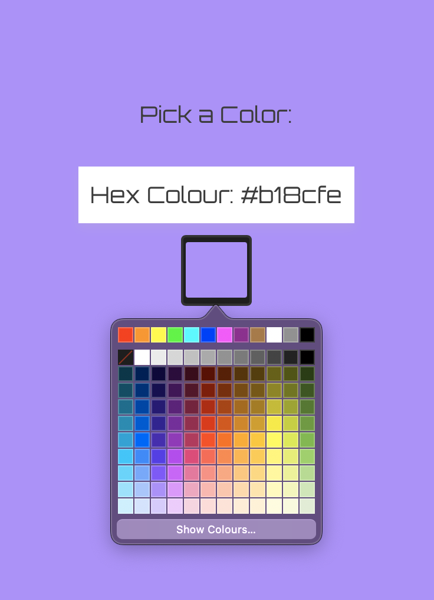
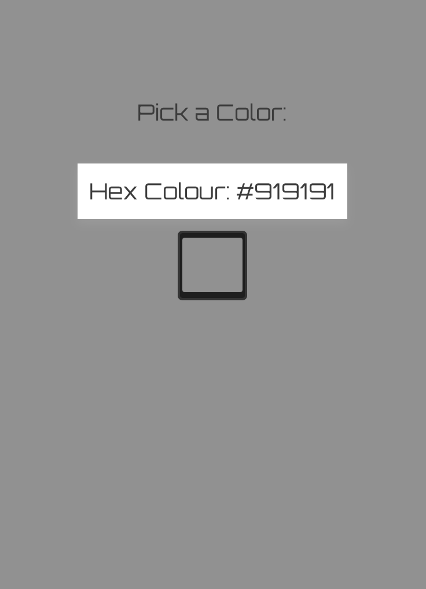

# Color Picker App 
Moon Orbit portfolio project—built Sep 2025.

A sleek React app for picking colors, grabbing hex codes with a dynamic background. Clean, centered UI with Orbitron font vibes.

## Features
- Interactive color picker.
- Real-time hex display.
- Responsive design.

  

## Tech Stack
- React (hooks for state magic)
- Vite (blazing-fast builds)
- CSS

## Quick Setup
1. Clone: `git clone https://github.com/kberthel/color-picker-app.git`
2. Install: `cd color-picker-app && npm install`.
3. Run: `npm run dev -- --port 3000`.
4. Open: http://localhost:3000.

See it live: [Vercel Demo](https://color-picker-app-three.vercel.app) [GitHub](https://kberthel.github.io/color-picker-app/).

## Notes
From dev log: Started as a simple picker, added styling tweaks. #react #portfolio

---
Built by Moon Orbit Coder 🌙 | [GitHub](https://github.com/kberthel)
